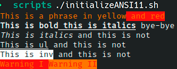

# Ejercicio #11: Initialize ANSI

## ¿Como _funciona_?

>Este Script nos permite traer los comandos de ANSI al lenguaje de Shell y asi poder visualizar texto en diferentes tonalidades.

### _Observacion_ ###
>Este Script trabaja por si solo asi que no requiere algun otro. Llega a tener problemas con el comando: cat>>EOF, solo se sustituye con un: echo -e.

## <span style="color:green">Script #11: Initialize ANSI </span> ##

```shell
#!/bin/bash

initializeANSI()
{
    esc='\033'

    #Foerground
    blackf="${esc}[30m";    redf="${esc}[31m";  greenf="${esc}[32m"
    yellowf="${esc}[33m";   bluef="${esc}[34m"; purplef="${esc}[35m"
    cyanf="${esc}[36m";     whitef="${esc}[37m"

    #Background
    blackb=="${esc}[40m";   redb="${esc}[41m";  greenb="${esc}[42m"
    yellowb="${esc}[43m";   blueb="${esc}[44m"; purpleb=="${esc}[45m"|
    cyanb="${esc}[46m";     whiteb="${esc}[47m"

    #Styles
    boldon="${esc}[1m";     boldoff="${esc}[22m"
    italicson="${esc}[3m";  italicsoff="${esc}[23m"
    ulon="${esc}[4m";       uloff="${esc}[24m"
    invon="${esc}[7m";      invoff="${esc}[27m"

    reset="${esc}[0m"
}
initializeANSI

echo -e "${yellowf}This is a phrase in yellow${redb} and red${reset}
${boldon}This is bold${ulon} this is italics${reset} bye-bye
${italicson}This is italics${italicsoff} and this is not
${ulon}This is ul${uloff} and this is not
${invon}This is inv${invoff} and this is not
${yellowf}${redb}Warning I ${yellowb}${redf}Warning II${reset}"
```

> ### Prueba de Escritorio ###

