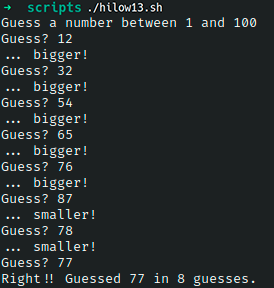

# Ejercicio #13: Hilow

## ¿Como _funciona_?

>Este Script nos permite analizar los errores en un Script por medio de un juego el cual es adivinar que numero es el que por asi decirlo "esta pensando".

### _Observacion_ ###
>Este Script trabaja por si solo asi que no requiere algun otro.

## <span style="color:green">Script #13: Hilow </span> ##

```shell
#!/bin/bash

biggest=100
guess=0
guesses=0

number=$(( $RANDOM % $biggest+1 ))
echo "Guess a number between 1 and $biggest"

while [ "$guess" -ne $number ] ; do
    /bin/echo -n "Guess? " ; read guess
    if [ "$guess" -lt $number ] ; then
        echo "... bigger!"
    elif [ "$guess" -gt $number ] ; then
        echo "... smaller!"
    fi
    guesses=$(( $guesses + 1 ))
done

echo "Right!! Guessed $number in $guesses guesses."

exit 0
```

> ### Prueba de Escritorio ###

