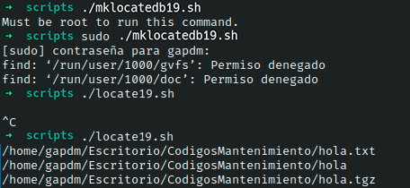

# Ejercicio #19: MKlocatedb

## ¿Como _funciona_?

>Este Script trabaja con dos codigos diferentes, el primero nos permitira crear un documento.db que contenera el nombre y direccion de tus documentos y con el segundo te permitira alcanzarlos por medio de ciertos caracteres en su ruta.

### _Observacion_ ###
>Este Script se ejecuta como root, y tambien sirve si solo colocas $sudo antes escribir el arhivo .sh.

## <span style="color:green">Script #19.1: Mklocaledb </span> ##

```shell
  #!/bin/sh

locatedb="/tmp/locate.db"

exec grep -i "$@" $locatedb

exit 0
```
## <span style="color:green">Script #19.2: Locale </span> ##

```shell
#!/bin/sh

locatedb="/tmp/locate.db"

exec grep -i "$@" $locatedb
```

> ### Prueba de Escritorio ###



