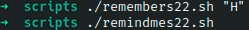

# Ejercicio #19: MKlocatedb

## ¿Como _funciona_?

>Este Script trabaja con dos codigos diferentes, el primero nos permitira crear una lista de cosas que tu le ingresas y los recordara, el segundo te mostrara dicha lista creada, y si colocas un argumento solo mostrara dichas palabras que tengan dicho argumento dentro de el.

### _Observacion_ ###
>Este Script se ejecuta bien por si solo.

## <span style="color:green">Script #22.1: Remember </span> ##

```shell
#!/bin/bash

rememberfile="$HOME/.remember"

if [ $# -eq 0 ] ; then
  echo "Enter note, end with ^D: "
  cat - >> $rememberfile
else
  echo "$@" >> $rememberfile
fi

exit 0
```
## <span style="color:green">Script #22.2: Remindme </span> ##

```shell
#!/bin/bash

rememberfile="$HOME/.remember"

if [ ! -f $rememberfile ] ; then
  echo "$0: You don't seem to have a .remember file." >&2
  echo "To remedy this, please use 'remember' to add reminders" >&2
  exit 1
fi

if [ $# -eq 0 ] ; then
  more $rememberfile
else
  grep -i -- "$@" $rememberfile | ${PAGER:-more}
fi

exit 0
```

> ### Prueba de Escritorio ###



