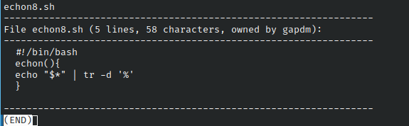

# Ejercicio #29: Showfile

## ¿Como _funciona_?

>Este Script muestra el contenido de un documento con texto, y lo convierte a algo parecido al nano de la consola.

### _Observacion_ ###
>Este Script se ejecuta bien por si solo.

## <span style="color:green">Script #29: Showfile </span> ##

```shell
#!/bin/bash

width=72
for input
do
  echo $input
  lines="$(wc -l < $input | sed 's/ //g')"
  chars="$(wc -c < $input | sed 's/ //g')"
  owner="$(ls -ld $input | awk '{print $3}')"
  echo "-----------------------------------------------------------------"
  echo "File $input ($lines lines, $chars characters, owned by $owner):"
  echo "-----------------------------------------------------------------"
  while read line 
  do
    if [ ${#line} -gt $width ] ; then
      echo "$line" | fmt | sed -e '1s/^/  /' -e '2,$s/^/+ /'
    else
      echo "  $line"
    fi
  done < $input

  echo "-----------------------------------------------------------------"

done | ${PAGER:more}

exit 0
```

> ### Prueba de Escritorio ###
