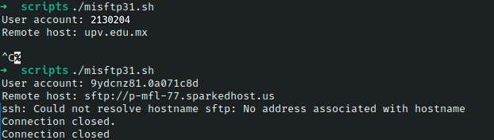

# Ejercicio #31: My Sftp

## ¿Como _funciona_?

>Este Script nos permite hacer mas atractivo y corto el comando sftp.

### _Observacion_ ###
>Este Script trabaja por si solo asi que no requiere algun otro. Sin un host la conexion se corta y como no dispongo de uno, marca error.

## <span style="color:green">Script #31: My Sftp </span> ##

```shell
#!/bin/bash

/bin/echo -n "User account: "
read account

if [ -z $account ] ; then
  exit 0;
fi

if [ -z "$1" ] ; then
  /bin/echo -n "Remote host: "
  read host
  if [ -z $host ] ; then
    exit 0
  fi
else
  host=$1
fi

exec sftp -C $account@$host
```

> ### Prueba de Escritorio ###

