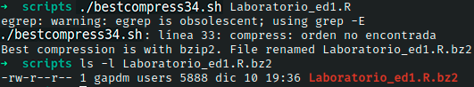

# Ejercicio #34: Best Compress

## ¿Como _funciona_?

>Este Script nos permite 3 opciones diferentes para poder comprimir y escoge la mejor.

### _Observacion_ ###
>Este Script trabaja por si solo asi que no requiere algun otro.

## <span style="color:green">Script #34: Best Compress </span> ##

```shell
#!/bin/bash
Z="compress"     gz="gzip"     bz="bzip2"
Zout="/tmp/bestcompress.$$.Z"
gzout="/tmp/bestcompress.$$.gz"
bzout="/tmp/bestcompress.$$.bz"
skipcompressed=1
if [ "$1" = "-a" ] ; then
  skipcompressed=0  ; shift
fi

if [ $# -eq 0 ]; then
  echo "Usage: $0 [-a] file or files to optimally compress" >&2; exit 1
fi

trap "/bin/rm -f $Zout $gzout $bzout" EXIT

for name in "$@"
do 
  if [ ! -f "$name" ] ; then 
    echo "$0: file $name not found. Skipped." >&2
    continue
  fi

  if [ "$(echo $name | egrep '(\.Z$|\.gz$|\.bz2$)')" != "" ] ; then
    if [ $skipcompressed -eq 1 ] ; then
      echo "Skipped file ${name}: It's already compressed." 
      continue
    else
      echo "Warning: Trying to double-compress $name" 
    fi
  fi

  $Z  < "$name" > $Zout  &
  $gz < "$name" > $gzout &
  $bz < "$name" > $bzout &
  wait 

  smallest="$(ls -l "$name" $Zout $gzout $bzout | \
     awk '{print $5"="NR}' | sort -n | cut -d= -f2 | head -1)"

  case "$smallest" in
     1 ) echo "No space savings by compressing $name. Left as is."
         ;;
     2 ) echo Best compression is with compress. File renamed ${name}.Z
         mv $Zout "${name}.Z" ; rm -f "$name"
         ;;
     3 ) echo Best compression is with gzip. File renamed ${name}.gz
         mv $gzout "${name}.gz" ; rm -f "$name"
         ;;
     4 ) echo Best compression is with bzip2. File renamed ${name}.bz2
         mv $bzout "${name}.bz2" ; rm -f "$name"
  esac
done

exit 0
```

> ### Prueba de Escritorio ###
