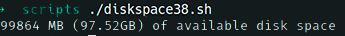

# Ejercicio #38: Disk Space

## ¿Como _funciona_?

>Este Script nos permite ver el espacio disponible en nuestro equipo.

### _Observacion_ ###
>Este Script trabaja por si solo asi que no requiere algun otro.

## <span style="color:green">Script #38: Disk Space </span> ##

```shell
#!/bin/bash
tempfile="/tmp/available.$$"

trap "rm -f $tempfile" EXIT

cat << 'EOF' > $tempfile
    { sum += $4 }
END { mb = sum / 1024
      gb = mb / 1024
      printf "%.0f MB (%.2fGB) of available disk space\n", mb, gb
    }
EOF

df -k | awk -f $tempfile
exit 0
```

> ### Prueba de Escritorio ###
