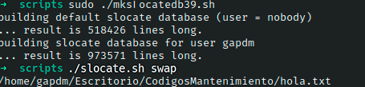

# Ejercicio #39: MKS Locatedb

## ¿Como _funciona_?

>Este Script a diferencia del anterior que tiene un nombre parecido, este crea una base donde se encuentran varias direcciones de nuestros documentos.

### _Observacion_ ###
>Este Script trabaja por si solo asi que no requiere algun otro. Pero al igual que el anterior este tambien trabaja en dos partes.

## <span style="color:green">Script #39.1: MKSlocatedb </span> ##

```shell
#!/bin/bash

locatedb="/var/locate.db"
slocatedb=".slocatedb"

if [ "$(id -nu)" != "root" ] ; then
  echo "$0: Error: You must be root to run this command." >&2
  exit 1
fi

if [ "$(grep '^nobody:' /etc/passwd)" = "" ] ; then
  echo "$0: Error: you must have an account for user 'nobody'" >&2
  echo "to create the default slocate database." >&2; exit 1
fi

cd /

su -fm nobody -c "find / -print" > $locatedb 2>/dev/null
echo "building default slocate database (user = nobody)"
echo ... result is $(wc -l < $locatedb) lines long.

for account in $(cut -d: -f1 /etc/passwd)
do
  homedir="$(grep "^${account}:" /etc/passwd | cut -d: -f6)"

  if [ "$homedir" = "/" ] ; then
    continue
  elif [ -e $homedir/$slocatedb ] ; then
    echo "building slocate database for user $account"
    su -m $account -c "find / -print" > $homedir/$slocatedb \
     2>/dev/null
    chmod 600 $homedir/$slocatedb
    chown $account $homedir/$slocatedb
    echo ... result is $(wc -l < $homedir/$slocatedb) lines long.
  fi
done

exit 0
```
## <span style="color:green">Script #39.2: Slocate </span> ##

```shell
#!/bin/bash

locatedb="/var/locate.db"
slocatedb="$HOME/.slocatedb"

if [ ! -e $slocatedb -o "$1" = "--explain" ] ; then
  cat << "EOF" >&2
Warning: Secure locate keeps a private database for each user, and your
database hasn't yet been created. Until it is (probably late tonight),
I'll just use the public locate database, which will show you all
publicly accessible matches rather than those explicitly available to
account ${USER:-$LOGNAME}.
EOF
  if [ "$1" = "--explain" ] ; then
    exit 0
  fi

  touch $slocatedb
  chmod 600 $slocatedb

elif [ -s $slocatedb ] ; then
  locatedb=$slocatedb
else
  echo "Warning: using public database. Use \"$0 --explain\" for details." >&2
fi

if [ -z "$1" ] ; then
  echo "Usage: $0 pattern" >&2; exit 1
fi

exec grep -i "$1" $locatedb
```

> ### Prueba de Escritorio ###
