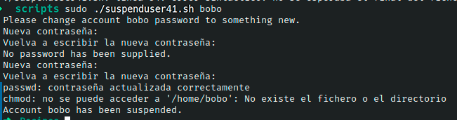

# Ejercicio #41: Suspenduser

## ¿Como _funciona_?

>Este Script nos permite poder cambiar contraseñas de los usuarios, como tambien sus permisos.

### _Observacion_ ###
>Este Script trabaja por si solo asi que no requiere algun otro, solo hay que ejecutarlo con $sudo.

## <span style="color:green">Script #41: Suspenduser </span> ##

```shell
#!/bin/bash

homedir="/home"
secs=10

if [ -z $1 ] ; then
  echo "Usage: $0 account" >&2 ; exit 1
elif [ "$(id -un)" != "root" ] ; then
  echo "Error. You must be 'root' to run this command." >&2; exit 1
fi

echo "Please change account $1 password to something new."
passwd $1

if who|grep "$1" > /dev/null ; then

  for tty in $(who | grep $1 | awk '{print $2}'); do

    cat << "EOF" > /dev/$tty

*************************************************************
URGENT NOTICE FROM THE ADMINISTRATOR:

This account is being suspended, and you are going to be logged out 
in $secs seconds. Please immediately shut down any processes you 
have running and log out.

If you have any questions, please contact your supervisor or 
John Doe, Director of Information Technology.
*************************************************************
EOF
  done

  echo "(Warned $1, now sleeping $secs seconds)"

  sleep $secs

  jobs=$(ps -u $1 | cut -d\  -f1)

  kill -s HUP $jobs                  
  sleep 1                            
  kill -s KILL $jobs > /dev/null 2>1 

  echo "$1 was logged in. Just logged them out."
fi

chmod 000 $homedir/$1

echo "Account $1 has been suspended."

exit 0
```

> ### Prueba de Escritorio ###
