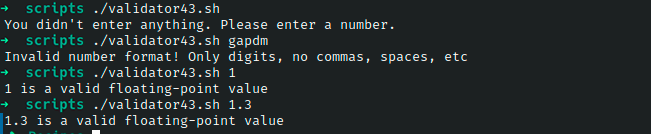

# Ejercicio #43: Validator

## ¿Como _funciona_?

>Este Script ejecuta el script dentro de library.

### _Observacion_ ###
>Este Script trabaja por si solo asi que no requiere algun otro, solo hay que tener el codigo library para poder ejecutar.

## <span style="color:green">Script #43: Validator </span> ##

```shell
#!/bin/bash

errors=0

source library.sh

validate()
{
  varname=$1    
  varvalue=$2
  
  if [ ! -z $varvalue ] ; then
    if [ "${varvalue%${varvalue#?}}" = "/" ] ; then
      if [ ! -x $varvalue ] ; then
        echo "** $varname set to $varvalue, but I cannot find executable."
        (( errors++ ))
      fi
    else
      if in_path $varvalue $PATH ; then 
        echo "** $varname set to $varvalue, but I cannot find it in PATH."
        errors=$(( $errors + 1 ))
      fi
    fi 
  fi
}

if [ ! -x ${SHELL:?"Cannot proceed without SHELL being defined."} ] ; then
  echo "** SHELL set to $SHELL, but I cannot find that executable."
  errors=$(( $errors + 1 ))
fi

if [ ! -d ${HOME:?"You need to have your HOME set to your home directory"} ]
then
  echo "** HOME set to $HOME, but it's not a directory."
  errors=$(( $errors + 1 ))
fi

oldIFS=$IFS; IFS=":"

for directory in $PATH
do
  if [ ! -d $directory ] ; then
      echo "** PATH contains invalid directory $directory"
      errors=$(( $errors + 1 ))
  fi
done

IFS=$oldIFS

validate "EDITOR" $EDITOR
validate "MAILER" $MAILER
validate "PAGER"  $PAGER

if [ $errors -gt 0 ] ; then
  echo "Errors encountered. Please notify sysadmin for help."
else
  echo "Your environment checks out fine."
fi

exit 0
```

> ### Prueba de Escritorio ###
