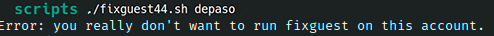

# Ejercicio #44: Fix Guest

## ¿Como _funciona_?

>Este Script nos permite limpiar el usuario de paso.

### _Observacion_ ###
>Este Script trabaja por si solo asi que no requiere algun otro, solo hay ejecutar con usuario de paso.

## <span style="color:green">Script #44: Fix Guest </span> ##

```shell
#!/bin/bash

iam=$(id -un)
myhome="$(grep "^${iam}:" /etc/passwd | cut -d: -f6)"

if [ "$iam" != "guest" ] ; then
  echo "Error: you really don't want to run fixguest on this account." >&2
  exit 1
fi

if [ ! -d $myhome/..template ] ; then
  echo "$0: no template directory found for rebuilding." >&2
  exit 1
fi

cd $myhome

rm -rf * $(find . -name ".[a-zA-Z0-9]*" -print)

cp -Rp ..template/* .
exit 0
```

> ### Prueba de Escritorio ###
