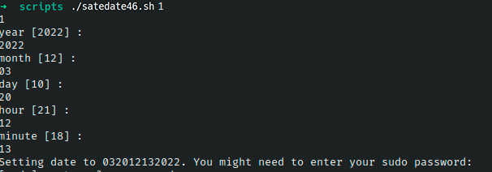

# Ejercicio #46: Set Date

## ¿Como _funciona_?

>Este Script nos permite cambiar la fecha dependiendo de los argumentos que incluyamos en el.

### _Observacion_ ###
>Este Script trabaja con **echon8.sh**, asi que es mejor llamar directamente a echon, ya que la library no lo deja ejecutar como es debido.

## <span style="color:green">Script #46: Set Date </span> ##

```shell
#!/bin/bash

. echon8.sh

askvalue()
{
  echon "$1 [$2] : "
  read answer
  if [ ${answer:=$2} -gt $3 ] ; then
    echo "$0: $1 $answer is invalid"; exit 0
  elif [ "$(( $(echo $answer | wc -c) - 1 ))" -lt $4 ] ; then
    echo "$0: $1 $answer is too short: please specify $4 digits"; exit 0
  fi
  eval $1=$answer
}

eval $(date "+nyear=%Y nmon=%m nday=%d nhr=%H nmin=%M")

askvalue year $nyear 3000 4
askvalue month $nmon 12 2
askvalue day $nday 31 2
askvalue hour $nhr 24 2
askvalue minute $nmin 59 2

squished="$month$day$hour$minute$year"

echo "Setting date to $squished. You might need to enter your sudo password:"
sudo date $squished

exit 0
```

> ### Prueba de Escritorio ###
