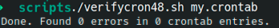

# Ejercicio #48: Verify Cron

## ¿Como _funciona_?

>Este Script nos permite revisar un documento **.cron** si es que este tiene errores.

### _Observacion_ ###
>Este Script trabaja por si solo.

## <span style="color:green">Script #48: Verify Cron </span> ##

```shell
#!/bin/bash

validNum()
{
  num=$1   max=$2

  if [ "$num" = "X" ] ; then
    return 0
  elif [ ! -z $(echo $num | sed 's/[[:digit:]]//g') ] ; then
    return 1
  elif [ $num -gt $max ] ; then
    return 1
  else
    return 0
  fi
}

validDay()
{

  case $(echo $1 | tr '[:upper:]' '[:lower:]') in
    sun*|mon*|tue*|wed*|thu*|fri*|sat*) return 0 ;;
    X) return 0 ;;
    *) return 1
  esac
}

validMon()
{
   case $(echo $1 | tr '[:upper:]' '[:lower:]') in 
     jan*|feb*|mar*|apr*|may|jun*|jul*|aug*) return 0           ;;
     sep*|oct*|nov*|dec*)                    return 0           ;;
     X) return 0 ;; # special case, it's an "*"
     *) return 1        ;;
   esac
}

fixvars()
{

  sourceline="$min $hour $dom $mon $dow $command"
   min=$(echo "$min" | tr '*' 'X')      
  hour=$(echo "$hour" | tr '*' 'X')     
   dom=$(echo "$dom" | tr '*' 'X')      
   mon=$(echo "$mon" | tr '*' 'X')      
   dow=$(echo "$dow" | tr '*' 'X')      
}

if [ $# -ne 1 ] || [ ! -r $1 ] ; then
  echo "Usage: $0 usercrontabfile" >&2; exit 1
fi

lines=0  entries=0  totalerrors=0

while read min hour dom mon dow command
do
  lines="$(( $lines + 1 ))" 
  errors=0
  
  if [ -z "$min" -o "${min%${min#?}}" = "#" ] ; then
    continue    
  fi


  ((entries++))

  fixvars

  for minslice in $(echo "$min" | sed 's/[,-]/ /g') ; do
    if ! validNum $minslice 60 ; then
      echo "Line ${lines}: Invalid minute value \"$minslice\""
      errors=1
    fi
  done
  
  for hrslice in $(echo "$hour" | sed 's/[,-]/ /g') ; do
    if ! validNum $hrslice 24 ; then
      echo "Line ${lines}: Invalid hour value \"$hrslice\"" 
      errors=1
    fi
  done

  for domslice in $(echo $dom | sed 's/[,-]/ /g') ; do
    if ! validNum $domslice 31 ; then
      echo "Line ${lines}: Invalid day of month value \"$domslice\""
      errors=1
    fi
  done

  for monslice in $(echo "$mon" | sed 's/[,-]/ /g') ; do
    if ! validNum $monslice 12 ; then
      if ! validMon "$monslice" ; then
        echo "Line ${lines}: Invalid month value \"$monslice\""
        errors=1
      fi
    fi
  done

  for dowslice in $(echo "$dow" | sed 's/[,-]/ /g') ; do
    if ! validNum $dowslice 7 ; then
      if ! validDay $dowslice ; then
        echo "Line ${lines}: Invalid day of week value \"$dowslice\""
        errors=1
      fi
    fi
  done

  if [ $errors -gt 0 ] ; then
    echo ">>>> ${lines}: $sourceline"
    echo ""
    totalerrors="$(( $totalerrors + 1 ))"
  fi
done < $1

echo "Done. Found $totalerrors errors in $entries crontab entries."

exit 0
```

> ### Prueba de Escritorio ###
