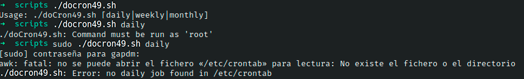

# Ejercicio #48: Do Cron

## ¿Como _funciona_?

>Este Script nos permite revisar un documento **.cron** si es que este tiene errores.

### _Observacion_ ###
>Este Script trabaja por si solo.

## <span style="color:green">Script #49: Do Cron </span> ##

```shell
#!/bin/bash

rootcron="/etc/crontab"

if [ $# -ne 1 ] ; then
  echo "Usage: $0 [daily|weekly|monthly]" >&2
  exit 1
fi

if [ "$(id -u)" -ne 0 ] ; then
  echo "$0: Command must be run as 'root'" >&2
  exit 1
fi

job="$(awk "NF > 6 && /$1/ { for (i=7;i<=NF;i++) print \$i }" $rootcron)"

if [ -z "$job" ] ; then
  echo "$0: Error: no $1 job found in $rootcron" >&2
  exit 1
fi

SHELL='which sh'

eval $job
```

> ### Prueba de Escritorio ###
