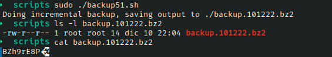

# Ejercicio #51: Back Up

## ¿Como _funciona_?

>Este Script nos permite realizar un backup.bz2 con la fecha y hora en que se realizo.

### _Observacion_ ###
>Este Script trabaja por si solo, hay que ejecutar con comando **sudo**.

## <span style="color:green">Script #51: Back Up </span> ##

```shell
#!/bin/bash

compress="bzip2"
inclist="./backup.inclist.$(date +%d%m%y)"
 output="./backup.$(date +%d%m%y).bz2"
 tsfile="./time"
  btype="incremental"
  noinc=0            

trap "/bin/rm -f $inclist" EXIT

usageQuit()
{
  cat << "EOF" >&2
Usage: $0 [-o output] [-i|-f] [-n]
  -o lets you specify an alternative backup file/device,
  -i is an incremental, -f is a full backup, and -n prevents
  updating the timestamp when an incremental backup is done.
EOF
  exit 1
}

while getopts "o:ifn" arg; do
  case "$opt" in
    o ) output="$OPTARG";       ;;
    i ) btype="incremental";    ;;
    f ) btype="full";           ;;
    n ) noinc=1;                ;;
    ? ) usageQuit               ;;
  esac
done

shift $(( $OPTIND - 1 ))

echo "Doing $btype backup, saving output to $output"

timestamp="$(date +'%m%d%I%M')"

if [ "$btype" = "incremental" ] ; then 
  if [ ! -f $tsfile ] ; then
    echo "Error: can't do an incremental backup: no timestamp file" >&2
    exit 1
  fi
  find $HOME -depth -type f -newer $tsfile -user ${USER:-LOGNAME} | \
  pax -w -x tar | $compress > $output
  failure="$?"
else
  find $HOME -depth -type f -user ${USER:-LOGNAME} | \
  pax -w -x tar | $compress > $output
  failure="$?"
fi

if [ "$noinc" = "0" -a "$failure" = "0" ] ; then
  touch -t $timestamp $tsfile
fi
exit 0
```

> ### Prueba de Escritorio ###
