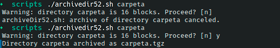

# Ejercicio #52: Archive Dir

## ¿Como _funciona_?

>Este Script nos crear un respaldo de una carpeta en especifico con formato **.tgz**.

### _Observacion_ ###
>Este Script trabaja por si solo.

## <span style="color:green">Script #52: Archive Dir </span> ##

```shell
#!/bin/bash

maxarchivedir=10           
compress=gzip              
progname=$(basename $0)    

if [ $# -eq 0 ] ; then     
  echo "Usage: $progname directory" >&2 ;exit 1
fi

if [ ! -d $1 ] ; then
  echo "${progname}: can't find directory $1 to archive." >&2; exit 1
fi

if [ "$(basename $1)" != "$1" -o "$1" = "." ] ; then
  echo "${progname}: you must specify a subdirectory" >&2
  exit 1
fi

if [ ! -w . ] ; then
  echo "${progname}: cannot write archive file to current directory." >&2
  exit 1
fi

dirsize="$(du -s $1 | awk '{print $1}')"

if [ $dirsize -gt $maxarchivedir ] ; then
  echo -n "Warning: directory $1 is $dirsize blocks. Proceed? [n] " 
  read answer
  answer="$(echo $answer | tr '[:upper:]' '[:lower:]' | cut -c1)"
  if [ "$answer" != "y" ] ; then
    echo "${progname}: archive of directory $1 canceled." >&2
    exit 0
  fi
fi

archivename="$1.tgz"

if tar cf - $1 | $compress > $archivename ; then
  echo "Directory $1 archived as $archivename"
else
  echo "Warning: tar encountered errors archiving $1"
fi

exit 0
```

> ### Prueba de Escritorio ###
