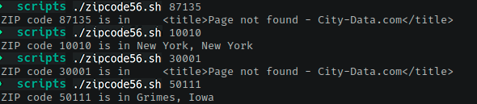

# Ejercicio #56: ZIP Code

## ¿Como _funciona_?

>Este Script nos permite ingresar un codigo **ZIP** de EUA que es lo equivalente a **Codigo Postal** en Mexico, y nos mostrara a que ciudad esta asignado.

### _Observacion_ ###
>Este Script trabaja solo si, se conecta a internet primero.

## <span style="color:green">Script #53: FTP Get </span> ##

```shell
#!/bin/bash

baseURL="http://www.city-data.com/zips"

/bin/echo -n "ZIP code $1 is in "

curl -s -dump "$baseURL/$1.html" | \
   grep -i '<title>' | \
   cut -d\( -f2 | cut -d\) -f1

exit 0
```

> ### Prueba de Escritorio ###
