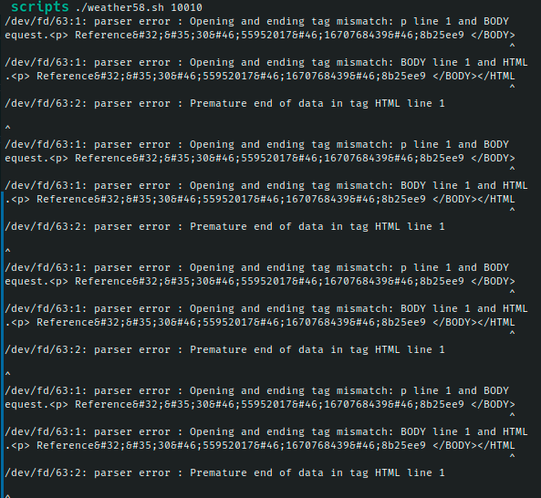

# Ejercicio #58: Weather

## ¿Como _funciona_?

>Este Script nos permite ingresar un codigo **ZIP** de EUA que es lo equivalente a **Codigo Postal** en Mexico, y nos mostrara el clima de dicho lugar asignado.

### _Observacion_ ###
>Se requiere de un **API** de **wunderground.com**.

## <span style="color:green">Script #58: Weather </span> ##

```shell
#!/bin/bash

if [ $# -ne 1 ]; then
  echo "Usage: $0 <zipcode>"
  exit 1
fi

apikey="603ce552cd7a4495bce552cd7a84952c"

weather=`curl -s \
    "https://api.wunderground.com/api/$apikey/conditions/q/$1.xml"`
state=`xmllint --xpath \
     //response/current_observation/display_location/full/text\(\) \
     <(echo $weather)`
zip=`xmllint --xpath \
     //response/current_observation/display_location/zip/text\(\) \
     <(echo $weather)`
current=`xmllint --xpath \
     //response/current_observation/temp_f/text\(\) \
     <(echo $weather)`
condition=`xmllint --xpath \
     //response/current_observation/weather/text\(\) \
     <(echo $weather)`

echo $state" ("$zip") : Current temp "$current"F and "$condition" outside." 
```

> ### Prueba de Escritorio ###
> El error proviene de la pagina y no del script.
