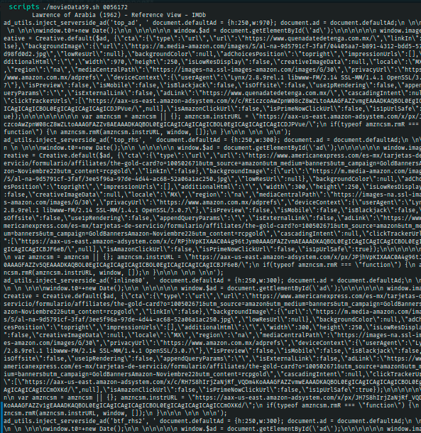

# Ejercicio #59: MovieDATA

## ¿Como _funciona_?

>Este Script nos permite ver la informacion de peliculas con el nombre indicado de la pagina IMDB o la descripcion de el id indicado.

### _Observacion_ ###
>Solo debe estar conectado a Internet.

## <span style="color:green">Script #59: MovieDATA </span> ##

```shell
#!/bin/bash

titleurl="http://www.imdb.com/title/tt"
imdburl="http://www.imdb.com/find?s=tt&exact=true&ref_=fn_tt_ex&q="
tempout="/tmp/moviedata.$$"

summarize_film()
{
   grep "<title>" $tempout | sed 's/<[^>]*>//g;s/(more)//'
   grep --color=never -A2 '<h5>Plot:' $tempout | tail -1 | \ cut -d\< -f1 | fmt | sed 's/^/    /'
   exit 0
}

trap "rm -f $tempout" 0 1 15

if [ $# -eq 0 ] ; then
  echo "Usage: $0 {movie title | movie ID}" >&2
  exit 1
fi

nodigits="$(echo $1 | sed 's/[[:digit:]]*//g')"

if [ $# -eq 1 -a -z "$nodigits" ] ; then
  lynx -source "$titleurl$1/combined" > $tempout
  summarize_film
  exit 0
fi

fixedname="$(echo $@ | tr ' ' '+')"	# for the URL

url="$imdburl$fixedname"

lynx -source $imdburl$fixedname > $tempout

fail="$(grep --color=never '<h1 class="findHeader">No ' $tempout)"

if [ ! -z "$fail" ] ; then
  echo "Failed: no results found for $1"
  exit 1
elif [ ! -z "$(grep '<h1 class="findHeader">Displaying' $tempout)" ] ; then
  grep --color=never '/title/tt' $tempout | \
  sed 's/</\
</g' | \
  grep -vE '(.png|.jpg|>[ ]*$)' | \
  grep -A 1 "a href=" | \
  grep -v '^--$' | \
  sed 's/<a href="\/title\/tt//g;s/<\/a> //' | \
   awk '(NR % 2 == 1) { title=$0 } (NR % 2 == 0) { print title " " $0 }' | \
  sed 's/\/.*>/: /' | \
  sort
fi

exit 0
```

> ### Prueba de Escritorio ###
> IMDB cambio las salidas de su pagina, y no son las mismas asi que solo arroja HTML.

