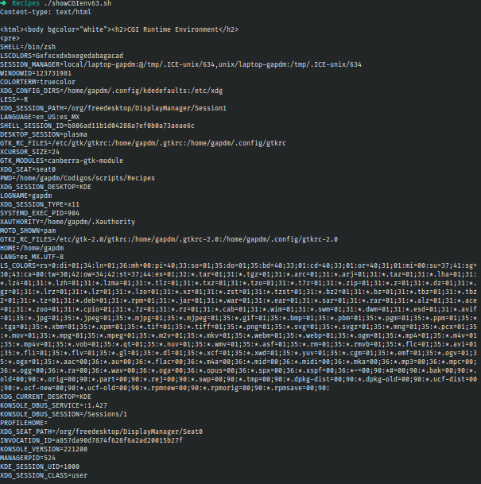

# Ejercicio #63: ShowCGI

## ¿Como _funciona_?

>Este Script nos permite imprimir un entorno de desarrollo en HTML.

### _Observacion_ ###
>Funciona por si solo.

## <span style="color:green">Script #63: ShowCGI </span> ##

```shell
#!/bin/bash

echo "Content-type: text/html"
echo ""

echo "<html><body bgcolor=\"white\"><h2>CGI Runtime Environment</h2>"
echo "<pre>"
env || printenv
echo "</pre>"
echo "<h3>Input stream is:</h3>"
echo "<pre>"
cat -
echo "(end of input stream)</pre></body></html>"

exit 0
```

> ### Prueba de Escritorio ###
