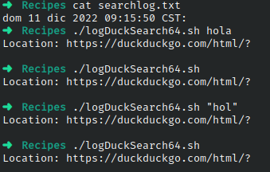

# Ejercicio #64: LogDuckDuckGo

## ¿Como _funciona_?

>Este Script nos permite generar un Log de busquedas.

### _Observacion_ ###
>Internet, y funciona directamente.

## <span style="color:green">Script #64: LogDuckDuckGo </span> ##

```shell
#!/bin/bash

logfile="./searchlog.txt"

if [ ! -f $logfile ] ; then
  touch $logfile
  chmod a+rw $logfile
fi

if [ -w $logfile ] ; then
  echo "$(date): $QUERY_STRING" | sed 's/q=//g;s/+/ /g' >> $logfile
fi

echo "Location: https://duckduckgo.com/html/?$QUERY_STRING"
echo ""

exit 0
```

> ### Prueba de Escritorio ###
