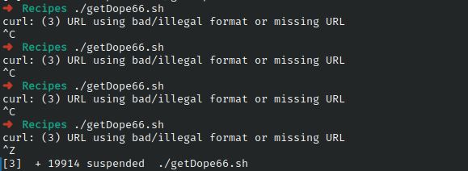

# Ejercicio #66:Get Dope

## ¿Como _funciona_?

>Este Script nos permite enviar una pagina de internet por medio de correo electronico.

### _Observacion_ ###
>Internet, y funciona directamente.

## <span style="color:green">Script #66: Get Dope </span> ##

```shell
#!/bin/bash
now="$(date +%y%m%d)"
start="http://www.straightdope.com/ "
to="gerairampdm@gmail.com"   

URL="$(curl -s "$start" | \
grep -A1 'teaser' | sed -n '2p' | \
cut -d\" -f2 | cut -d\" -f1)"

( cat << EOF
Subject: The Straight Dope for $(date "+%A, %d %B, %Y")
From: Cecil Adams <dont@reply.com>
Content-type: text/html
To: $to

EOF

curl "$URL"
) | /usr/sbin/sendmail -t

exit 0
```

> ### Prueba de Escritorio ###
> 