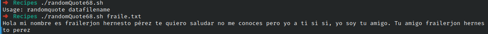

# Ejercicio #68:Random Quote

## ¿Como _funciona_?

>Este Script selecciona de un archivo con texto, una palabra aleatoria.

### _Observacion_ ###
>Internet, y funciona directamente.

## <span style="color:green">Script #68: Random Quote </span> ##

```shell
#!/bin/bash

awkscript="/tmp/randomquote.awk.$$"

if [ $# -ne 1 ] ; then
  echo "Usage: randomquote datafilename" >&2
  exit 1
elif [ ! -r "$1" ] ; then
  echo "Error: quote file $1 is missing or not readable" >&2
  exit 1
fi

trap "$(which rm) -f $awkscript" 0

cat << "EOF" > $awkscript
BEGIN { srand() }
      { s[NR] = $0 } 
END   { print s[randint(NR)] } 
function randint(n) { return int (n * rand() ) + 1 }
EOF

awk -f $awkscript < "$1"

exit 0
```

> ### Prueba de Escritorio ###
> 