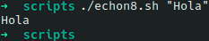

# Ejercicio #8: Echon

## ¿Como _funciona_?

>Este Script es un poco mas sencillo ya que gracias a el se pueden usar mas Scripts del libro, ya que remplaza el "echo -n" y lo compacta.

### _Observacion_ ###
>Este Script trabaja por si solo asi que no requiere algun otro, ya que es tan sencillo como un echo.

## <span style="color:green">Script #6: Echon </span> ##

```shell
#!/bin/bash
echo "$*" | awk '{ printf "%s", $0 }'
```

> ### Prueba de Escritorio ###

