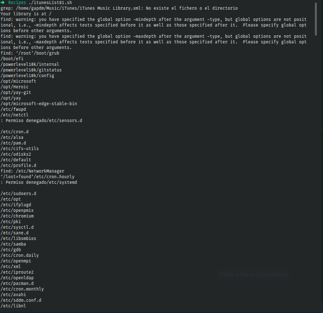

# Ejercicio #81:iTunesList

## ¿Como _funciona_?

>Este Script nos imprime todas las subcarpetas de la libreria de iTunes en tu computadora.

### _Observacion_ ###
>Necesitas tener instalado iTunes para que funcione.

## <span style="color:green">Script #81: iTunesList </span> ##

```shell
#!/bin/bash

itunehome="$HOME/Music/iTunes"
ituneconfig="$itunehome/iTunes Music Library.xml"

musiclib="/$(grep '>Music Folder<' "$ituneconfig" | cut -d/ -f5- | \
   cut -d\< -f1 | sed 's/%20/ /g')"

echo "Your library is at $musiclib"

if [ ! -d "$musiclib" ] ; then
  echo "$0: Confused: Music library $musiclib isn't a directory?" >&2
  exit 1
fi

exec find "$musiclib" -type d -mindepth 2 -maxdepth 2 \! -name '.*' -print |
   sed "s|$musiclib/||"
```

> ### Prueba de Escritorio ###
> 