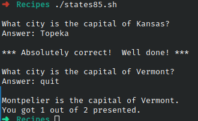

# Ejercicio #85: States

## ¿Como _funciona_?

>Este Script es es un juego para adivinar las capitales de los estados de USA.

### _Observacion_ ###
>Funciona directamente.Se decarga un documento con estados y su capital con extension **.txt**.

## <span style="color:green">Script #85: States </span> ##

```shell
#!/bin/bash

db="./state.capitals.txt"     

if [ ! -r "$db" ] ; then
  echo "$0: Can't open $db for reading." >&2
  echo "(get http://www.intuitive.com/wicked/examples/state.capitals.txt" >&2
  echo "save the file as $db and you're ready to play!)" >&2
  exit 1
fi

guesses=0; correct=0; total=0

while [ "$guess" != "quit" ] ; do
  
  thiskey="$(./randomQuote68.sh $db)"

  state="$(echo $thiskey | cut -d\   -f1 | sed 's/-/ /g')"
   city="$(echo $thiskey | cut -d\   -f2 | sed 's/-/ /g')"
  match="$(echo $city | tr '[:upper:]' '[:lower:]')"

  guess="??" ; total=$(( $total + 1 )) ;

  echo ""
  echo "What city is the capital of $state?"

  while [ "$guess" != "$match" -a "$guess" != "next" -a "$guess" != "quit" ]
  do
    /bin/echo -n "Answer: "
    read guess

    if [ "$guess" = "$match" -o "$guess" = "$city" ] ; then
      echo ""
      echo "*** Absolutely correct!  Well done! ***"
      correct=$(( $correct + 1 ))
      guess=$match
    elif [ "$guess" = "next" -o "$guess" = "quit" ] ; then
      echo ""
      echo "$city is the capital of $state." 
    else
      echo "I'm afraid that's not correct."
    fi 
  done

done

echo "You got $correct out of $total presented."
exit 0
```

> ### Prueba de Escritorio ###
> 