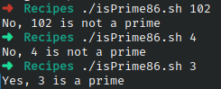

# Ejercicio #86: Is Prime

## ¿Como _funciona_?

> Este Script indica si un numero es primo o no.

### _Observacion_ ###
> Funciona directamente.

## <span style="color:green">Script #86: Is Prime </span> ##

```shell
#!/bin/bash

  counter=2
remainder=1

if [ $# -eq 0 ] ; then
  echo "Usage: isprime NUMBER" >&2
  exit 1
fi

number=$1

if [ $number -lt 2 ] ; then
  echo "No, $number is not a prime" ; exit 0
fi

while [ $counter -le $(expr $number / 2) -a $remainder -ne 0 ]
do
  remainder=$(expr $number % $counter)
  counter=$(expr $counter + 1)
done

if [ $remainder -eq 0 ] ; then
  echo "No, $number is not a prime"
else
  echo "Yes, $number is a prime"
fi
exit 0
```

> ### Prueba de Escritorio ###
> 