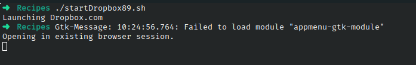

# Ejercicio #89: StartDropbox

## ¿Como _funciona_?

> Este Script abre Dropbox.com

### _Observacion_ ###
> Funciona directamente.Conexion a Internet y un Navegador.

## <span style="color:green">Script #89: StartDropbox </span> ##

```shell
#!/bin/bash

app="Dropbox.com"
verbose=1

running="$(ps aux | grep -i $app | grep -v grep)"

if [ "$1" = "-s" ] ; then
  verbose=0
fi

if [ ! -z "$running" ] ; then
  if [ $verbose -eq 1 ] ; then
    echo "$app is running with PID $(echo $running | cut -d\  -f2)"
  fi
else
  if [ $verbose -eq 1 ] ; then
    echo "Launching $app"
  fi
  xdg-open $app
fi

exit 0
```

> ### Prueba de Escritorio ###
> 