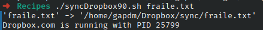

# Ejercicio #90: SyncDropbox

## ¿Como _funciona_?

> Este Script mueve un documento a una carpeta de Dropbox y desoues abre Dropbox.com.

### _Observacion_ ###
> Funciona directamente.Ocupa una carpeta ~/Dropbox/sync

## <span style="color:green">Script #90: SyncDropbox </span> ##

```shell
#!/bin/bash

name="syncdropbox"
dropbox="$HOME/Dropbox"
sourcedir=""
targetdir="sync"

if [ $# -eq 0 ] ; then
  echo "Usage: $0 [-d source-folder] {file, file, file}" >&2 ; exit 1
fi 

if [ "$1" = "-d" ] ; then
  sourcedir="$2"
  shift; shift
fi

if [ ! -z "$sourcedir" -a $# -ne 0 ] ; then
  echo "$name: you can't specify both a directory and specific files." >&2 ; exit 1
fi

if [ ! -z "$sourcedir" ] ; then
  if [ ! -d "$sourcedir" ] ; then
    echo "$name: please specify a source directory with -d" >&2 ; exit 1
  fi
fi

if [ ! -z "$sourcedir" ] ; then
 if [ -f "$dropbox/$sourcedir" -o -d "$dropbox/$sourcedir" ] ; then
    echo "$name: specified source directory $sourcedir already exists in $dropbox" >&2 ; exit 1
  fi

  echo "Copying contents of $sourcedir to $dropbox..."
  cp -a "$sourcedir" $dropbox	
else
  if [ ! -d "$dropbox/$targetdir" ] ; then
    mkdir "$dropbox/$targetdir"
    if [ $? -ne 0 ] ; then
      echo "$name: Error encountered during mkdir $dropbox/$targetdir" >&2 ; exit 1
    fi
  fi

 cp -p -v $@ "$dropbox/$targetdir"
fi

exec ./startDropbox89.sh "Dropbox.com"
```

> ### Prueba de Escritorio ###
> 