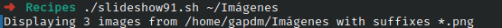

# Ejercicio #91: SildeShow
## ¿Como _funciona_?

> Este Script abre las imagenes de un conjunto de carpetas.

### _Observacion_ ###
> Funciona directamente.Ocupa una carpeta con Imagenes
> 
## <span style="color:green">Script #91: SildeShow </span> ##

```shell
#!/bin/bash

delay=2
psize="1200x900>"	

if [ $# -eq 0 ] ; then
  echo "Usage: $(basename $0) watch-directory" >&2 ; exit 1
fi

watch="$1"

if [ ! -d "$watch" ] ; then
  echo "$(basename $0): specified watch directory $watch isn't a directory" >&2 ; exit 1
fi

cd "$watch"

if [ $? -ne 0 ] ; then
  echo "$(basename $0): failed trying to cd into $watch" >&2 ; exit 1
fi

suffixes="$(file * | grep image | cut -d: -f1 | rev | cut -d. -f1 | \
   rev | sort | uniq | sed 's/^/\*./')"

if [ -z "$suffixes" ] ; then
  echo "$(basename $0): no images to display in folder $watch" >&2 ; exit 1
fi

/bin/echo -n "Displaying $(ls $suffixes | wc -l) images from $watch "
set -f ; echo with suffixes $suffixes ; set +f

display -loop 0 -delay $delay -resize $psize -backdrop $suffixes

exit 0
```

> ### Prueba de Escritorio ###
> 