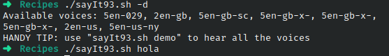

# Ejercicio #93: Say It
## ¿Como _funciona_?

> Este Script ejecuta el comando speak-ng para usar tts.

### _Observacion_ ###
> Funciona directamente. El paquete espeak-ng instalado.
> 
## <span style="color:green">Script #93: Say It </span> ##

```shell
#!/bin/bash

dosay="`which speak-ng`"
format="`which fmt` -w 70"

voice=""
rate=""

demovoices()
{
   voicelist=$( speak-ng --voices \? | grep "/en" | cut -c1-12 | 
       sed 's/ /_/;s/ //g;s/_$//')

   if [ "$1" = "list" ] ; then
     echo Available voices: $(echo $voicelist | sed 's/ /, /g;s/_/ /g') | $format
     echo "HANDY TIP: use \"$(basename $0) demo\" to hear all the voices"
     exit 0
   fi

   for name in $voicelist ; do
     myname=$(echo $name | sed 's/_/ /')
     echo "Voice: $myname"
     $dosay -v "$myname" "Hello! I'm $myname. This is what I sound like."
   done

   exit 0
}

usage()
{
   echo "Usage: sayit [-v voice] [-r rate] [-f file] phrase"
   echo "   or: sayit demo"
   exit 0
}

while getopts "df:r:v:" opt; do
  case $opt in
    d ) demovoices list	   ;;
    f ) input="$OPTARG"    ;;
    r )  rate="-r $OPTARG" ;;
    v ) voice="$OPTARG"    ;;
  esac
done

shift $(($OPTIND - 1))

if [ $# -eq 0 -a -z "$input" ] ; then
  $dosay "Dude! You haven't given me any parameters to work with."
  echo "Error: no parameters specified. Specify a file or phrase"
  exit 0
fi

if [ "$1" = "demo" ] ; then
  demovoices
fi

if [ ! -z "$input" ] ; then
  $dosay $rate -v "$voice" -f $input
else
  $dosay $rate -v "$voice" "$*"
fi
exit 0
```

> ### Prueba de Escritorio ###
> 