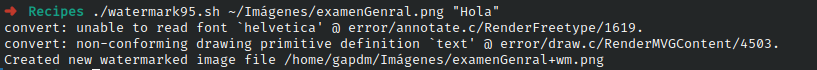

# Ejercicio #95: Water Mark

## ¿Como _funciona_?

> Este Script agrega una marca de agua a una imagen.

### _Observacion_ ###
> Funciona directamente.
> 
## <span style="color:green">Script #95: Water Mark </span> ##

```shell
#!/bin/bash

wmfile="/tmp/watermark.$$.png"
fontsize="44"		

trap "`which rm` -f $wmfile" 0 1 15

if [ $# -ne 2 ] ; then
  echo "Usage: $(basename $0) imagefile "watermark text"" >&2 ; exit 1
fi

if [ ! -r "$1" ] ; then
  echo "$(basename $0): Can't read input image $1" >&2 ; exit 1
fi

dimensions="$(identify -format "%G" "$1")"

convert -size $dimensions xc:none -pointsize $fontsize -gravity south \
  -draw "fill black text 1,1 '$2' text 0,0 '$2' fill white text 2,2 '$2'" \
  $wmfile

suffix="$(echo $1 | rev | cut -d. -f1 | rev)"
prefix="$(echo $1 | rev | cut -d. -f2- | rev)"

newfilename="$prefix+wm.$suffix"
composite -dissolve 75% -gravity south $wmfile "$1" "$newfilename"

echo "Created new watermarked image file $newfilename"

exit 0
```

> ### Prueba de Escritorio ###
> 